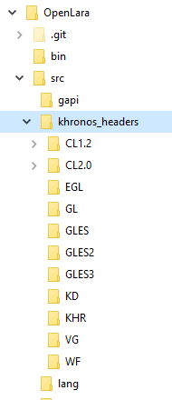

# Building OpenLara for Windows

Get additional [OpenGL headers](https://www.khronos.org/registry/khronos_headers.zip) and extract them to the **OpenLara\src** folder so it reads: 
> 

Open **OpenLara\src\platform\win\OpenLara.sln** in Visual Studio (I use Visual Studio Community 2017).

Modify the *Debug* and *Release* configurations to add the new include path (see the **..\\..\khronos_headers** path added to the *Include Directories* parameter in the picture below):
> 

You can also change some *Debugging* properties so that a default level is played when you run OpenLara from Visual Studio (or when the project has finished building):
* 
* put in the *Working Directory* parameter the directory where your Tomb Raider levels live (it is relative to the **OpenLara\src\platform\win** directory)
* put in the *Command Arguments* parameter the path to the level you want to play (relative to the previous path)
* don't forget to do that for both the *Debug* and *Release* configurations!

Build either the *Debug* or *Release* configuration: after the building is finished, OpenLara should start automatically with the level you configured in the previous step..
